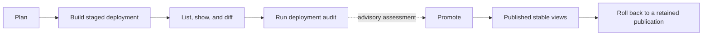
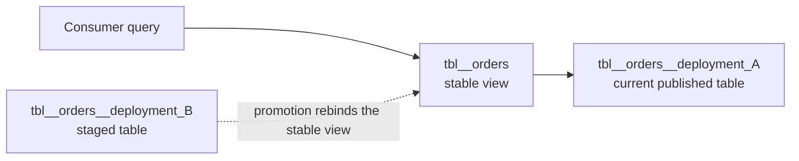

Virtual environments preserve StreamBuild's versioned deployment workflow. Use virtual mode as the
project default:

```toml
[defaults]
pipeline_mode = "virtual"
```

Alternatively, set `mode = "virtual"` in an individual `pipeline.toml`.

The lifecycle is:



Planning and building do not affect the published graph. Inspection and a deployment audit inform
the operator, but the resulting readiness assessment is advisory rather than a promotion lock.
Promotion binds the stable views to the staged deployment; rollback can later bind the complete
graph to a retained prior publication.

In this workflow, **audit** is the operation and **assessment** is its overall result. The deployment
audit combines staged-versus-active comparisons, replay coverage, and applicable SQL data-quality
audits into a `ready`, `caution`, or `not_ready` assessment.

## Build

```bash
stb build --auto-approve
stb build --select orders --full-refresh --auto-approve
stb build --select orders --start-time 2026-07-01T00:00:00Z --auto-approve
```

Build creates deployment-specific model objects while the active stable views remain unchanged:

```text
tbl__orders__20260729T120000Z_ab12cd
mv__orders__20260729T120000Z_ab12cd
```

The deployment ID is generated as `YYYYMMDDTHHMMSSZ_<six-hex>` unless supplied with
`--deployment-id`.

## Discover and inspect

Build prints the generated ID. You can also reconstruct inventory from authoritative warehouse
evidence:

```bash
stb deployment list
stb deployment show 20260729T120000Z_ab12cd
```

Inventory distinguishes active, staged, superseded, incomplete, metadata-missing, and
physical-missing deployments. List and show are read-only.

The development UI exposes the same inventory and deployment detail, including scoped lineage,
staged-versus-live changes, promotion preview, resumable partial promotion, and retained rollback
guidance. Cleanup is also available from the deployment list. Audit and rollback remain explicit CLI
operations.

Compare the active graph with a retained deployment, or compare two explicit endpoints:

```bash
stb deployment diff 20260729T120000Z_ab12cd
stb deployment diff 20260729T120000Z_ab12cd:20260730T120000Z_cd34ef
```

Diff reports added, removed, changed, unchanged, and physically missing model relations using model
presence, schemas, physical availability, and current row counts. Either explicit endpoint may be
`active`.

## Audit staged data

```bash
stb deployment audit 20260729T120000Z_ab12cd
```

`stb deployment audit` compares staged and active data, checks replay coverage, runs applicable SQL
audits, and reports an overall assessment:

- `ready` means the available evidence satisfies the configured freshness and row-count checks and
  no error-severity SQL audit failed.
- `caution` means the evidence is incomplete or warrants review, such as unavailable freshness
  evidence, missing replay partitions, or a staged row count below the configured ratio.
- `not_ready` means a stronger negative signal was found, such as lag beyond the configured limit,
  an empty staged relation replacing a populated active relation, or a failed error-severity SQL
  audit.

Warning-severity SQL audit failures appear in the results but do not by themselves change the
overall assessment.

Configure the advisory replay thresholds in committed project configuration:

```toml
[defaults.deployment_readiness]
maximum_lag = "30s"
minimum_staged_row_ratio = 0.5
```

<Warning>
  The assessment is an operator safety signal, not an enforced promotion lock. `deployment promote`
  does not require a previously persisted `ready` result.
</Warning>

## Promote

```bash
stb deployment promote 20260729T120000Z_ab12cd
```

Promotion creates or replaces stable views such as `tbl__orders` to read from the selected deployment
table. ClickHouse replaces each relation atomically, but the complete graph is **not graph-atomic**:
bindings are switched one relation at a time and StreamBuild reports that capability in output.



Before promotion, consumers reach deployment A through the unsuffixed stable view and deployment B
remains staged. Promotion replaces that view definition so it reads deployment B. The replacement
is atomic for this one relation only; a multi-model graph can be partly switched if promotion stops,
and retry applies the remaining bindings.

Before confirmation, the CLI and UI show additions, replacements, removals, and orphaned live
relations. If promotion stops after switching only part of the graph, the deployment remains
retryable and the next promotion applies only the remaining changes.

Show, audit, and promote require explicit positional IDs. There is no automatic sole-candidate or
latest-candidate selection.

## Roll back

Roll back the complete stable graph to the immediately preceding distinct publication or an explicit
previously published deployment:

```bash
stb deployment rollback --previous
stb deployment rollback 20260729T120000Z_ab12cd
```

Rollback requires confirmation unless `--auto-approve` is supplied. JSON mode also requires
`--auto-approve`. StreamBuild rejects staged, unpublished, already-active, missing, and drifted
targets rather than guessing from partial state.

<Warning>
  Rollback restores a prior publication's definitions and bindings, not a historical data snapshot.
  Retained streaming graphs remain live and may have received newer rows since publication.
</Warning>

## Operational commands

```bash
stb doctor
DEPLOYMENT_ID="replace-with-deployment-id"
stb repair active-view --table tbl__orders --deployment-id "$DEPLOYMENT_ID"
stb reconcile
stb reconcile --apply
stb janitor
stb janitor --retention-days 30 --apply
```

- [`doctor`](/cli/doctor) diagnoses stable-view and deployment-reference problems.
- [`repair active-view`](/cli/repair) points one broken logical view at a known deployment.
- [`reconcile`](/cli/reconcile) previews or records a compatible live metadata baseline.
- [`janitor`](/cli/janitor) previews or removes stale deployment objects while protecting active and
  rollback-retained state.

Promotion, rollback, repair, reconciliation, and janitor operations must not overlap against the
same target database.

These commands are virtual-environment-only. There is no automatic mode conversion or direct-mode
equivalent.
