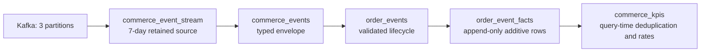

The repository includes a self-contained direct-mode commerce project. It is designed to make the
important behavior visible without external services or hidden setup:

- Redpanda creates `source.order_events.live` with exactly three partitions and seven-day retention.
- A stateful local producer emits a fixed-key JSON contract with integer quantities and prices.
- ClickHouse retains the source and serves four coherent SQL models.
- Four SQL tests exercise region labels, additive facts, replay deduplication, and expression macros.
- A scheduled warning audit and local console sensor demonstrate failure and natural recovery.

<Note>
  The checked-in project uses direct mode. `stb build` replaces its model relations immediately; it
  does not create a staged deployment or require promotion.
</Note>

## Prerequisites

- Python 3.12 or newer
- Node.js 20.19 or newer and npm
- [`uv`](https://docs.astral.sh/uv/getting-started/installation/)
- [Docker with Compose](https://docs.docker.com/compose/install/)

## Start the demo

From a StreamBuild source checkout:

```bash
git clone https://github.com/chio-labs/streambuild.git
cd streambuild
make ui-install ui-build
uv tool install --editable .
cd examples/orders_demo
cp .env.example .env
make start
```

`make start` builds the producer image, waits for healthy services, creates the topic, and applies
the StreamBuild project. Every published service binds to loopback:

| Service | Address |
|---|---|
| StreamBuild UI, after `make dev` | `http://127.0.0.1:8000` |
| Redpanda broker | `redpanda.localhost:19092` |
| Redpanda Console | `http://localhost:18081` |
| ClickHouse HTTP | `localhost:18123` |
| ClickHouse native | `localhost:19000` |

The shared `redpanda.localhost` broker name resolves to loopback for the host-side UI and to the
Redpanda service inside Compose. This lets ClickHouse ingest while StreamBuild reads real broker
metadata for Topics and Kafka lag.

## Event contract

Every message carries the same keys and stable types:

```text
event_id, event_type, schema_version, order_id, customer_id, product, category,
quantity, unit_price_cents, currency, status, region_code, event_at
```

Quantities and `unit_price_cents` are JSON integers. The regular producer uses monotonic IDs and a
durable pending-event checkpoint, so a crash can only resend the same event body under an ID. The
one-shot injector uses a separate timestamp-based ID namespace. Producer state lives in a disposable
Compose volume so restarts continue active lifecycles.

<Frame>
  
</Frame>

## Model graph



`order_event_facts` remains append-only because replay delivery is at least once. The terminal view
groups by event ID and keeps the highest replay offset before deriving revenue, average order value,
cancellation rate, and refund rate. Non-additive values are never stored in a summing engine, and
consumers that require event-level uniqueness use the same explicit event-ID reduction.

Region names come from a tested deterministic SQL macro rather than a mutable side table in the
streaming path. Logical event cardinality remains one-to-one when measured by unique event ID during
both live ingestion and replay; physical append-only tables can temporarily contain exact replay
duplicates.

## Verify the project

Compile and run the focused SQL tests:

```bash
stb compile --project-dir .
stb test --project-dir .
```

Expected summary:

```text
Pipelines: 1
Models: 4
Results: 4 passed, 0 failed
```

Rebuild from retained source history at any time:

```bash
stb build --project-dir .
```

The direct build reports one replay root and all authored audit invariants passing. In ClickHouse,
the following query should return the same logical event count in every column:

```sql
SELECT
  (SELECT uniqExact(JSONExtractString(kafka_value, 'event_id'))
   FROM raw__commerce_event_stream) AS source_events,
  (SELECT uniqExact(event_id) FROM tbl__commerce_events) AS commerce_events,
  (SELECT uniqExact(event_id) FROM tbl__order_events) AS order_events,
  (SELECT uniqExact(event_id) FROM tbl__order_event_facts) AS fact_events;
```

## Inspect live state

Start the UI, audit scheduler, and sensor runner:

```bash
make dev
```

Open `http://127.0.0.1:8000`. The source page reports retained history separately from Kafka lag and
shows landed, committed, and broker-end offsets for all three partitions.

<Frame>
  
</Frame>

The terminal `commerce_kpis` query-only view has no physical freshness measurement, so the UI marks
its status as unknown rather than falsely calling it stalled.

With `make dev` still running, execute the repeatable full-stack acceptance checks:

```bash
make verify
```

This compiles the project, runs all four SQL tests and every audit, verifies three-partition broker
retention, checks logical event cardinality and region labels in ClickHouse, and confirms API drift,
view freshness, partition lag, and the four-model graph.

Run the controlled warning, natural recovery, and sensor-delivery acceptance lane separately. It
takes about 30 seconds:

```bash
make verify-warning
```

## Demonstrate warning and recovery

Keep `make dev` running. In a second terminal, inject one event 30 seconds into the future:

```bash
make inject
```

The `orders_no_future_events` audit has a ten-second cadence, matching the scheduler polling loop. It
records one sampled warning row, links
back to `order_events`, and triggers the local-only `ConsoleNotifier`:

```text
[orders-demo] WARNING: orders_no_future_events on demo has 1 failing row(s). Inspect: http://127.0.0.1:8000/quality?audit=orders_no_future_events. Sample: {"event_id":"...","order_id":"...","event_at":"..."}
```

<Frame>
  
</Frame>

The event remains in ClickHouse. Once the clock is within two seconds of its timestamp, the next
scheduled read passes naturally and the same sensor prints:

```text
[orders-demo] RECOVERED: orders_no_future_events on demo. Inspect: http://127.0.0.1:8000/quality?audit=orders_no_future_events
```

No webhook is configured or sent. Set `FUTURE_EVENT_SECONDS` in `.env` to lengthen the observation
window.

## Stop or reset

Stop containers while preserving local volumes:

```bash
make stop
```

Remove all disposable broker, producer-state, and warehouse volumes, then start a clean stack:

```bash
make reset
```
