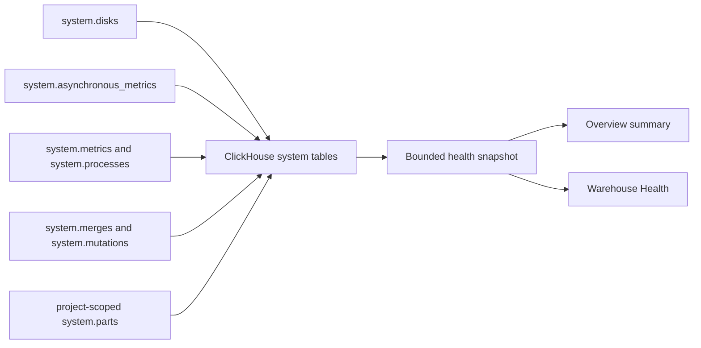

Warehouse Health provides a current operational snapshot of the ClickHouse target selected by
`stb dev`. Use the compact Overview summary to notice capacity pressure, then open this page to see
which measured resource needs investigation.

<Note>
  Warehouse Health is lightweight diagnostic evidence, not a durable metrics store or a replacement
  for ClickHouse monitoring. StreamBuild does not retain these measurements, cancel queries, change
  settings, or perform cleanup from this page.
</Note>

## What StreamBuild reads

The snapshot reports:

| Area | Measurements |
|---|---|
| Server | Adapter, ClickHouse version, uptime, collection time, and collection duration |
| Capacity | Total, free, and unreserved bytes for each configured ClickHouse disk |
| Filesystem | Main data-path inode totals when ClickHouse exposes them |
| Memory | ClickHouse server RSS and host or cgroup context when both sides are meaningful |
| Activity | Queries other than the diagnostic query, active merges, and incomplete mutations |
| Project storage | Active rows, bytes, and part counts for the selected project database's largest tables |

Table-level measurements are restricted to the selected project database and returned as a bounded
largest-table list. They are not a cluster-wide inventory.

## Status and missing evidence

The page distinguishes `healthy`, `warning`, `critical`, and `unknown`. Capacity warnings are based
on ClickHouse's unreserved bytes because merges, inserts, and moves can reserve space that the
filesystem still reports as free.

Missing evidence is never converted to zero or healthy:

- **Available** means the core capacity snapshot and optional sections were collected.
- **Partial** means core evidence is usable but an optional measurement could not be read.
- **Unavailable** means StreamBuild could not collect enough evidence to assess the warehouse.
- **Stale** means the displayed successful snapshot predates the latest failed refresh.

When cgroup usage and limits are available, StreamBuild can report memory pressure within that
boundary. Otherwise it labels the values separately as ClickHouse server RSS and host memory. It
does not present server RSS divided by host RAM as total host utilization.

Collection failures do not replace known values with zeros or make the rest of the project state
unavailable. Check the measurement timestamp and diagnostic message before treating an older value
as current evidence.

## Responding to capacity pressure

Warehouse Health is intentionally read-only. When it reports low disk or inode capacity:

1. Stop or reduce avoidable writes and rebuilds.
2. Confirm the affected ClickHouse disk and whether unreserved capacity is lower than free capacity.
3. Inspect the largest project tables and active part counts for context.
4. Use your normal ClickHouse and infrastructure tooling to investigate retention, detached data,
   logs, snapshots, replication, and filesystem allocation.
5. Restore physical headroom before restarting destructive builds or replay.

Do not delete ClickHouse files directly based only on this page.
